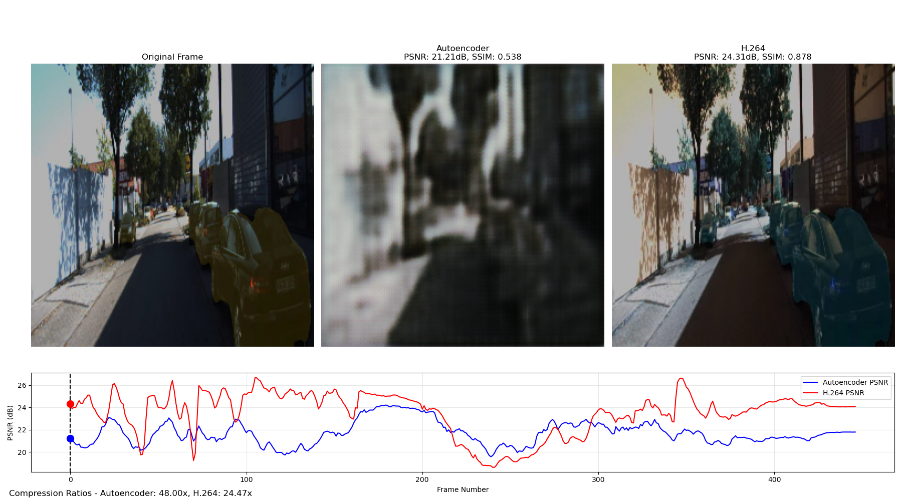
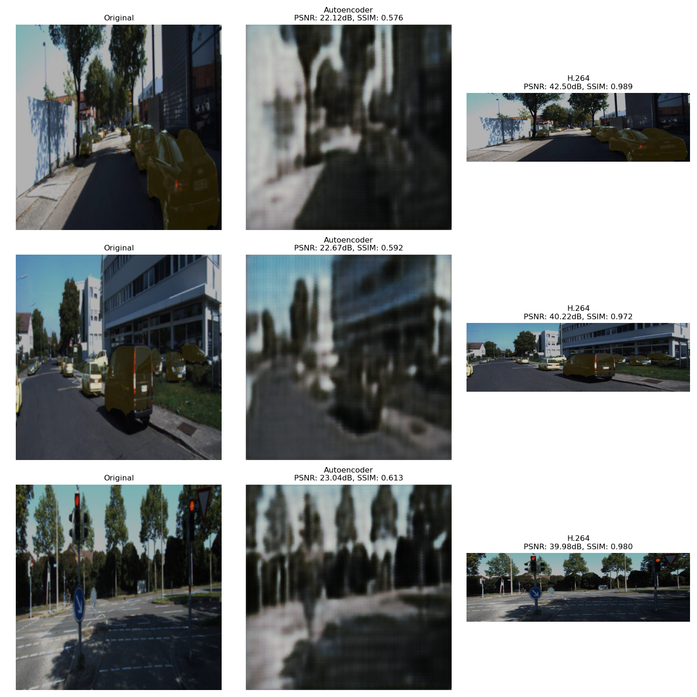

# ML-Based Video Compression with Autoencoders



## Project Overview

This project implements a neural network-based video compression system using autoencoders and compares its performance against traditional H.264 compression. It demonstrates how machine learning approaches can be applied to video compression tasks and explores the trade-offs between compression ratio, visual quality, and computational requirements.

### Key Features

- Neural autoencoder-based frame compression
- Latent space quantization to simulate real-world compression
- Side-by-side comparison with H.264 compression
- Comprehensive metrics analysis (PSNR, SSIM)
- Visual reports and video comparisons

### Demo



## Technical Approach

This project is divided into four stages:

1. **Frame Extraction**: Extracting individual frames from source videos
2. **Autoencoder Construction**: Building and training a neural network for compression
3. **Compression Evaluation**: Comparing results with traditional methods
4. **Results Visualization**: Generating reports and visual comparisons

### Architecture

The autoencoder architecture consists of:

- **Encoder**: Convolutional neural network that compresses frames into a low-dimensional latent space
- **Quantizer**: Reduces precision of latent representations to simulate bit-rate constraints
- **Decoder**: Transposed convolutional network that reconstructs frames from compressed representations

## Implementation Details

### Stage 1: Frame Extraction

The frame extraction module uses OpenCV to:
- Read video files and extract individual frames
- Support flexible frame selection (intervals, max counts)
- Provide video metadata (FPS, dimensions, duration)

```python
# Extract frames example
video_path = "your_video.mp4"
output_dir = "extracted_frames"
frames = extract_frames(video_path, output_dir, interval=1)
```

### Stage 2: Autoencoder for Frame Compression

The autoencoder model:
- Compresses each RGB frame to a lower-dimensional representation
- Quantizes the latent space to mimic real-world bitrate limitations
- Reconstructs frames through the decoder network
- Uses MSE loss for optimization

```python
# Model architecture
encoder = Encoder(latent_dim=64)
quantizer = Quantizer(num_bits=8)
decoder = Decoder(latent_dim=64)
model = VideoAutoencoder(latent_dim=64, num_bits=8)
```

### Stage 3: Compression Evaluation

The evaluation system:
- Calculates PSNR and SSIM metrics for both compression methods
- Computes compression ratios and efficiency
- Handles different frame formats and input types
- Provides statistical analysis of results

### Stage 4: Results Visualization

The visualization component:
- Creates side-by-side comparisons of different compression methods
- Generates an HTML report with comprehensive metrics
- Produces a video showing comparisons across frames
- Visualizes quality metrics over time

## Results

Here are the key findings from our compression experiments:

| Metric | Autoencoder | H.264 (CRF 23) |
|--------|-------------|----------------|
| Avg PSNR | 21.71 dB | 23.52 dB |
| Avg SSIM | 0.5373 | 0.8966 |
| Min PSNR | 19.58 dB | 18.63 dB |
| Min SSIM | 0.4353 | 0.8451 |
| Max PSNR | 24.21 dB | 26.69 dB |
| Max SSIM | 0.6296 | 0.9264 |
| Compression Ratio | 48:1 | 24.47:1 |

### Analysis

- **Quality vs. Compression**: Our autoencoder achieves significantly higher compression ratios (48:1) compared to H.264 (24.47:1), but at a lower PSNR (21.71 dB vs. 23.52 dB) and SSIM (0.54 vs. 0.90).
- **Content Sensitivity**: Both methods show quality fluctuations across frames, with challenging scenes around frames 200-250 where both methods experience quality drops. H.264 appears to handle high-detail scenes better.
- **Temporal Consistency**: The autoencoder shows more stable PSNR values throughout the video with less dramatic peaks and valleys, while H.264 exhibits higher variation but generally better quality. The distribution histograms show that autoencoder's quality metrics cluster more tightly.
- **Trade-off Analysis**: This experiment highlights the fundamental trade-off between compression efficiency and visual quality. Our neural approach prioritizes compression ratio over matching the perceptual quality of traditional codecs.

## Installation and Usage

### Prerequisites

- Python 3.8+
- PyTorch 1.7+
- OpenCV
- NumPy, Matplotlib, tqdm
- Scikit-image

### Setup

```bash
# Clone the repository
git clone https://github.com/yourusername/ml-video-compression.git
cd ml-video-compression

# Install dependencies
pip install -r requirements.txt
```

### Running the Pipeline

```bash
# 1. Extract frames from a video
python extract_frames.py --video input_video.mp4 --output extracted_frames

# 2. Train the autoencoder
python frame_autoencoder.py --frames extracted_frames --epochs 10

# 3. Evaluate compression
python compression_evaluation.py --model video_autoencoder.pth --frames extracted_frames

# 4. Visualize results
python results_visualization.py
```


